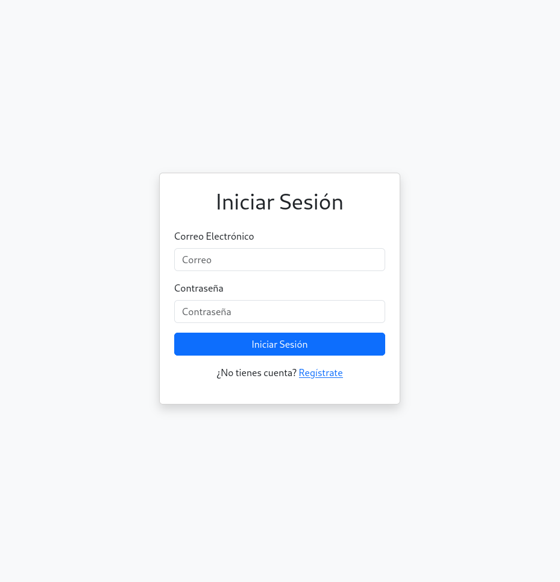
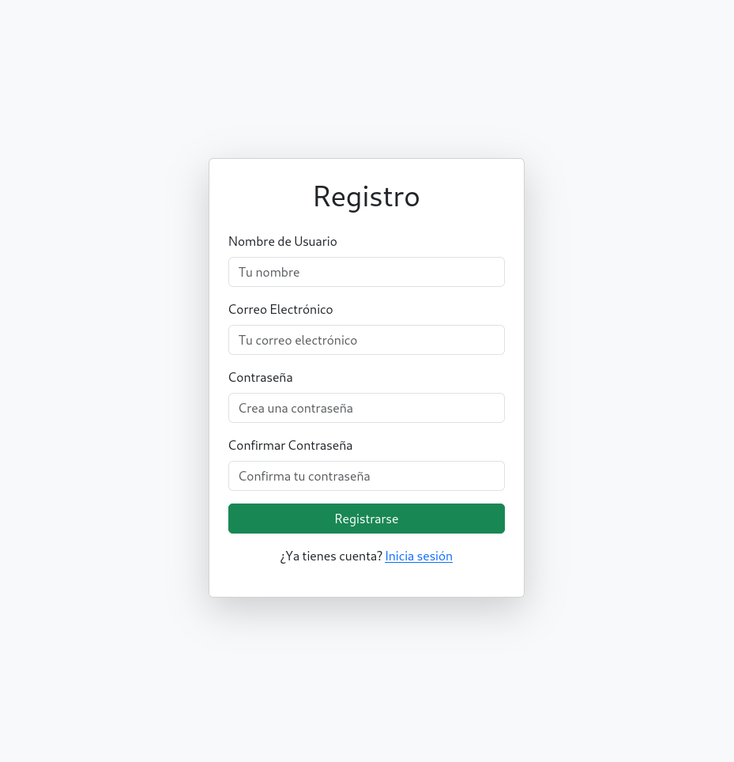
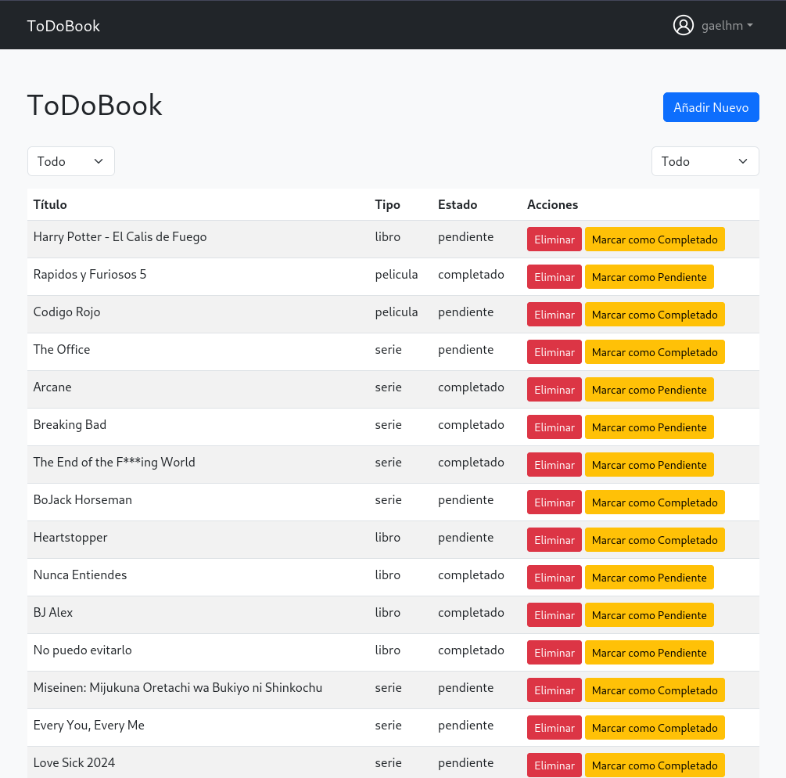
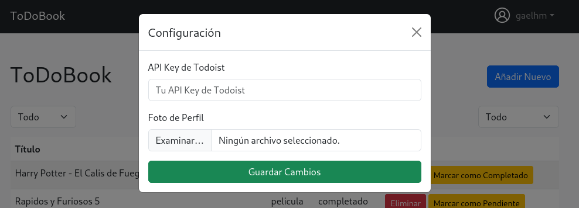
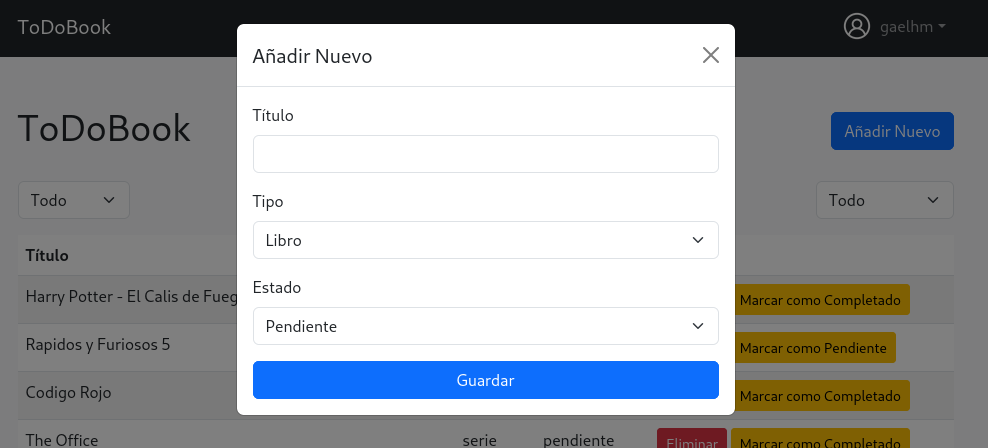
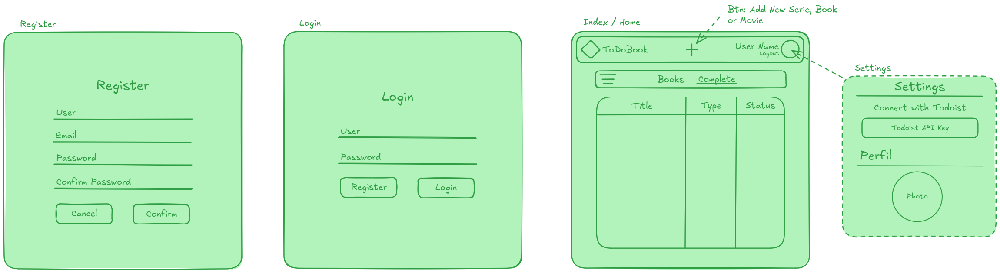

# ToDo_Book

## Descripción

ToDo_Book es una aplicación web diseñada para llevar un seguimiento de libros, películas y series que deseas o has visto. La herramienta permite registrar, actualizar y organizar tus contenidos de entretenimiento de manera sencilla. Además, ofrece una integración opcional con la API de Todoist, lo que permite visualizar tus libros directamente en la aplicación Todoist.

## Tecnologías Utilizadas

- **PHP**
- **Bootstrap**
- **MySQL**

## Instalación

1. Clona este repositorio en tu máquina local:
   ```bash
   git clone https://github.com/Wonkoly/ToDo_Book.git
   ```
2. Configura la conexión a la base de datos:
   - Crea un archivo `.env` en la raíz del proyecto con las siguientes variables:
     ```env
     DB_HOST=localhost
     DB_NAME=nombre_de_tu_base_de_datos
     DB_USER=tu_usuario
     DB_PASSWORD=tu_contraseña
     ```
3. Importa el esquema de base de datos proporcionado en el repositorio a tu servidor MySQL.

4. Inicia el servidor local usando PHP:
   ```bash
   php -S 0.0.0.0:8080
   ```

5. Accede a la aplicación desde tu navegador en `http://localhost:8080`.

## Características

### Vistas principales
1. **Inicio de sesión**
   - Permite a los usuarios autenticarse en la aplicación.
   

2. **Registro**
   - Los nuevos usuarios pueden registrarse proporcionando su información básica.
   

3. **Página principal**
   - Visualiza y organiza tus libros, películas y series. Cambia el estado de los elementos y elimina entradas si es necesario.
   

4. **Modal de configuración**
   - Configura tu clave de API de Todoist y cambia tu foto de perfil.
   

5. **Modal de añadir nuevo**
   - Agrega un nuevo libro, película o serie especificando su tipo y estado inicial.
   

6. **Diseño general**
   - Diseño intuitivo basado en Bootstrap, optimizado para usabilidad.
   

## Base de Datos

A continuación, se muestra el esquema base de las tablas utilizadas en este proyecto. Crea estas tablas en tu base de datos MySQL.

```sql
CREATE TABLE `items` (
  `id` int NOT NULL AUTO_INCREMENT,
  `user_id` int NOT NULL,
  `title` varchar(255) NOT NULL,
  `type` enum('libro','serie','pelicula') NOT NULL,
  `status` enum('pendiente','completado') DEFAULT 'pendiente',
  `created_at` timestamp NULL DEFAULT CURRENT_TIMESTAMP,
  PRIMARY KEY (`id`),
  KEY `user_id` (`user_id`),
  CONSTRAINT `items_ibfk_1` FOREIGN KEY (`user_id`) REFERENCES `users` (`id`) ON DELETE CASCADE
) ENGINE=InnoDB DEFAULT CHARSET=utf8mb4;

CREATE TABLE `users` (
  `id` int NOT NULL AUTO_INCREMENT,
  `name` varchar(100) NOT NULL,
  `email` varchar(255) NOT NULL UNIQUE,
  `password` varchar(255) NOT NULL,
  `created_at` timestamp NULL DEFAULT CURRENT_TIMESTAMP,
  PRIMARY KEY (`id`)
) ENGINE=InnoDB DEFAULT CHARSET=utf8mb4;
```

## Integración con Todoist

Si decides integrar la API de Todoist:
1. Genera una API Key desde tu cuenta de Todoist.
2. Ingresa la clave en la sección de configuración.
3. La aplicación creará automáticamente un proyecto en Todoist llamado `ToDoBook`, donde tus libros, series y películas se organizarán por secciones.   